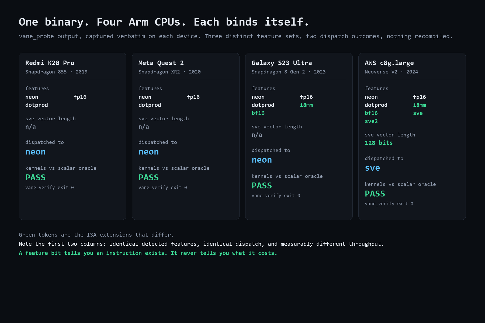
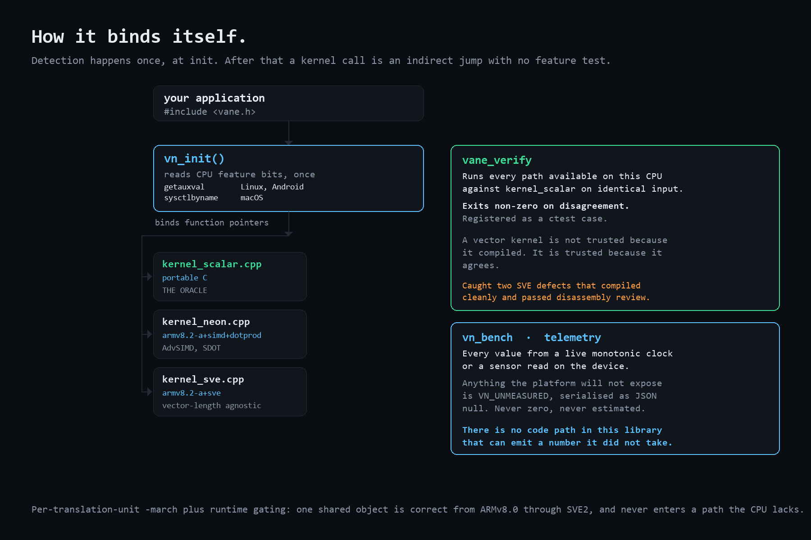
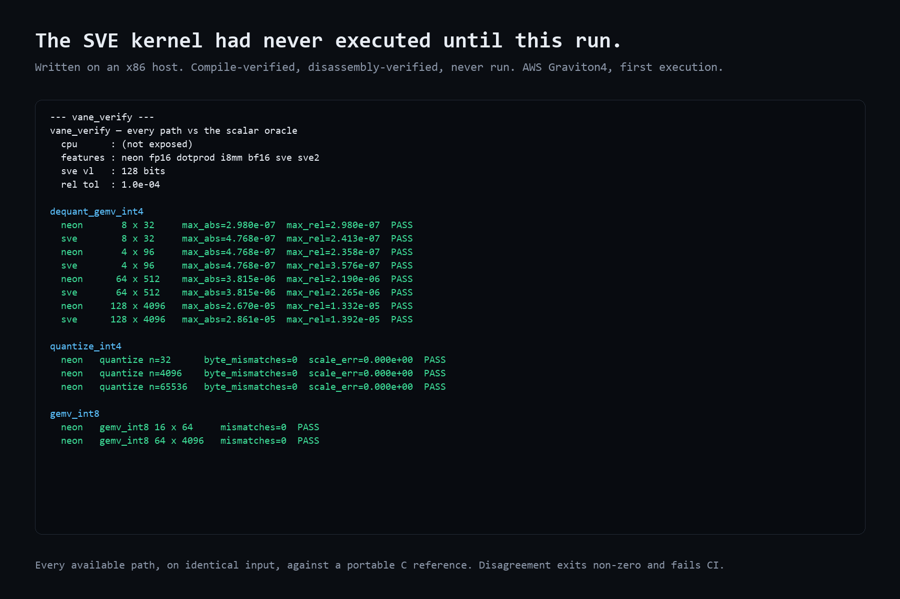
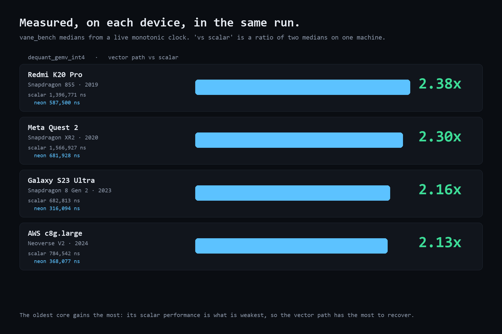
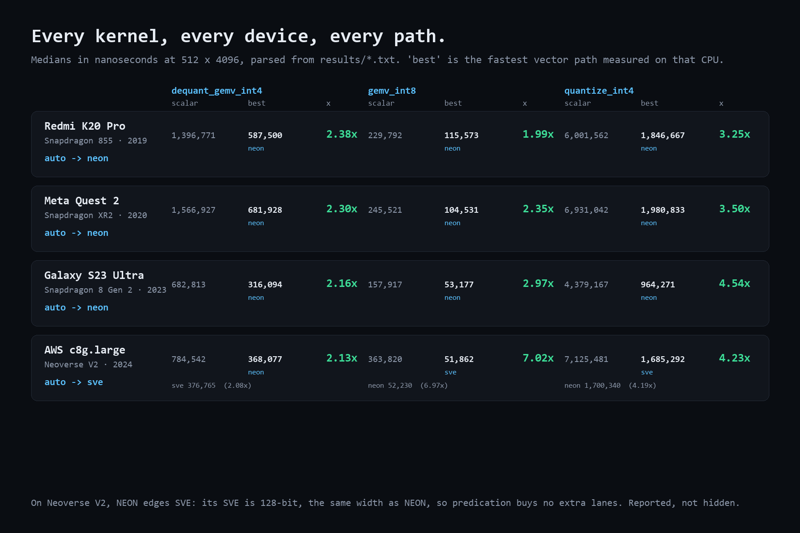

<div align="center">

# Vane

**One binary, every Arm core.**

Runtime ISA dispatch and honest telemetry for Arm — in about 1,400 lines of C++.

[](LICENSE)
[](#)
[](#)

</div>



## Contents

- [The problem](#the-problem)
- [What it does](#what-it-does)
- [Quickstart](#quickstart)
- [Try the demo](#try-the-demo)
- [API](#api)
- [Two bugs this library exists to not have](#two-bugs-this-library-exists-to-not-have)
- [Measured results](#measured-results)
- [Status](#status)
- [Repository layout](#repository-layout)

---

## The problem

You write a NEON kernel. It flies on your laptop. On a Quest it is slower than
scalar. On a Neoverse server it never touches SVE at all. On a phone it looks
excellent for ninety seconds and then thermal-throttles into the floor.

You have no idea which kernel is running where, and the benchmark you ran
measured the first second of a workload that has to survive an hour.

Vane answers both questions. `vane_probe` answers the first, and every field it
prints is read from the CPU it runs on. This is a real capture, copied out of
[`results/s23-ultra.txt`](results/s23-ultra.txt):

```
vane probe
  cpu             : (not exposed)
  os              : android
  features        : neon fp16 dotprod i8mm bf16
  sve vector len  : n/a
  dispatched to   : neon

  available paths : scalar neon
```

`cpu` reads `(not exposed)` because this device's `/proc/cpuinfo` carries
neither a `Hardware` nor a `model name` line, which are the two fields
[`read_cpu_desc`](src/vane_dispatch.cpp) looks for. That is a blank, not a
guess — the same policy that emits JSON `null` for a sensor the platform will
not hand over.

---

## What it does

**Detects, then binds — once.** `vn_init()` reads the CPU's feature bits
(`getauxval` on Linux and Android, `sysctlbyname` on macOS,
`IsProcessorFeaturePresent` on Windows on Arm) and points each operation at the
best kernel available. After that a call is an indirect jump with no feature
testing on the hot path.

**One shared object, every core.** Each kernel translation unit is compiled at
its own `-march` baseline — `armv8.2-a+simd+dotprod` for NEON,
`armv8.2-a+sve` for SVE. Runtime gating guarantees an unsupported path is never
entered, so raising one file's baseline never raises the library's minimum CPU
requirement. The same `vane.so` is correct on an ARMv8.0 Cortex-A53 and on a
Neoverse V2 with 2048-bit vectors.

**Scalar is the oracle, not the fallback.** `vane_verify` runs every path
available on the current CPU against the portable C reference on identical
input and exits non-zero on disagreement. It is registered as a `ctest` case.
Vector kernels are not trusted because they compiled — they are trusted because
they agree.

**Telemetry that cannot lie.** Every number `vn_bench` reports comes from a
live monotonic clock or a sensor read on the device. Anything the platform does
not expose is `VN_UNMEASURED` and serialises to JSON `null`. There is no code
path in this library that emits an estimated, modelled or defaulted metric.



---

## Quickstart

```bash
git clone https://github.com/dj-DeepakJadhav/Vane.git && cd Vane
cmake -B build -DCMAKE_BUILD_TYPE=Release
cmake --build build
./build/vane_probe     # what does this CPU have?
./build/vane_verify    # do all its paths agree with the oracle?
./build/vane_bench     # what does each path actually cost?
```

On an Android device or a Quest, one command does the whole loop — build,
push, run, capture:

```powershell
.\scripts\run_on_android.ps1 -Label s23-ultra
```

It writes `results/s23-ultra.txt` verbatim from the device and refuses to
present the benchmark as trustworthy if the verifier exited non-zero.

To run on server-class Arm, see [GRAVITON.md](GRAVITON.md).

---

## Try the demo

**[demo/atlas](demo/README.md)** — semantic search over 25,000 GloVe word
vectors, quantised into Vane's INT4 format and searched with a single
`vn_dequant_gemv_int4` call per query. The whole index is 5.0 MB, so it ships
inside this repository. The browser only draws; every similarity score and
every microsecond figure it shows came out of a kernel running on the Arm core
serving the page.

```bash
cmake -B build && cmake --build build
./build/atlas_server --data demo/atlas.bin --html demo/atlas.html
# open http://localhost:8080
```

Toggle **scalar / neon / sve** mid-session and the same query runs through a
different kernel on the same device. Full instructions, including the
one-command Android and Quest deploy, are in [demo/README.md](demo/README.md).


---

## API

```c
#include <vane.h>

vn_init();                        // detect and bind, once

vn_caps_t caps;
vn_get_caps(&caps);               // features, SVE vector length, CPU string

// INT4 block format: +8 zero point, 32 elements/block, fp32 scale/block.
// 0.625 B/element against float16's 2 B/element — 68.75% smaller.
vn_quantize_int4(src, packed, scales, n);

// Fused dequantise + matrix-vector product. Dispatched.
vn_dequant_gemv_int4(packed, scales, vec, out, rows, cols);

// INT8 GEMV. Uses SDOT where FEAT_DotProd is present.
vn_gemv_int8(m, vec, out, rows, cols);

// Pin a path — for A/B measurement and for the equivalence harness.
vn_force_path(VN_PATH_SCALAR);
```

The INT4 layout uses the `+8` zero point of llama.cpp's `Q4_0`, so weights can
be shared with that ecosystem without transcoding.

---

## Two bugs this library exists to not have

Both are easy to write, invisible in a smoke test, and caught immediately by
`vane_verify`. They are documented at the top of
[`src/kernels/kernel_sve.cpp`](src/kernels/kernel_sve.cpp) because they are the
reason the verifier exists.

**1. The interleave.** In a packed INT4 block, byte *j* holds element *2j* in
its low nibble and *2j+1* in its high nibble. After masking, the low nibbles
are the block's **even** elements and the high nibbles the **odd** ones. A
kernel that loads the vector contiguously and multiplies it against those
nibbles silently pairs the wrong operands. The fix is a de-interleaving load —
`vld2q_f32` on NEON, `svld2_f32` on SVE — and it is visible in the emitted
machine code:

```
ld1b { z2.s }, p1/z, [x17]          // 4 packed bytes -> 4 lanes
ld2w { z3.s, z4.s }, p1/z, [x16]    // de-interleaved: evens, odds
```

**2. The predication.** `svmla_f32_z` **zeroes** inactive lanes. Applied to an
accumulator that carries across loop iterations, a partial predicate silently
discards everything accumulated in the inactive lanes. This is invisible at
128, 256 and 512-bit — where `svcntw()` divides the block evenly — and corrupts
results at 1024-bit and above. That is precisely the vector-length agnosticism
SVE exists to provide. Loop-carried accumulators must use the merging form,
`svmla_f32_m`.



---

## Measured results

Every capture in [`results/`](results/) is written by a script and committed
unedited. A number reaches this README only by being copied out of one of those
files.

| Device | SoC | Detected features | Dispatched | Verify | Capture |
|---|---|---|---|---|---|
| AWS `c8g.large` | **Neoverse V2** | `neon fp16 dotprod i8mm bf16 sve sve2` | **`sve`** (128-bit) | **PASS** | [`graviton4.txt`](results/graviton4.txt) |
| Galaxy S23 Ultra | SM8550 | `neon fp16 dotprod i8mm bf16` | `neon` | **PASS** | [`s23-ultra.txt`](results/s23-ultra.txt) |
| Meta Quest 2 | XR2 (SM8250) | `neon fp16 dotprod` | `neon` | **PASS** | [`quest2.txt`](results/quest2.txt) |
| Redmi K20 Pro | SM8150 | `neon fp16 dotprod` | `neon` | **PASS** | [`redmi-k20-pro.txt`](results/redmi-k20-pro.txt) |

One binary, four very different CPUs — a cloud server, a flagship phone, a
standalone VR headset and a 2019 mid-range handset — three distinct feature
sets, every available path agreeing with the scalar oracle on every one.

Read the **Detected features** column downward: `sve2`, then `i8mm bf16`, then
plain `dotprod` twice. Three rungs of the Arm ladder, five years of silicon
apart, detected at runtime out of one unmodified `vane.so`. Nothing was
recompiled between those rows.



### Every kernel, every device



Medians in nanoseconds at 512 × 4096, parsed from `results/*.txt` by
[`media/make_media.py`](media/make_media.py). `vs scalar` is always a ratio of
two medians measured in the **same run on the same machine**.

### Four things the numbers actually say

**SVE is not faster than NEON on Neoverse V2 — by 2%.** Its SVE is 128 bits
wide, the same as NEON, so the SVE path buys predication and length-agnosticism
but no extra lanes while paying for predicate setup. The dispatcher currently
prefers SVE whenever present, and on this CPU that preference is very slightly
wrong. A feature bit tells you an instruction set *exists*; it does not tell you
it is *faster*. This is the concrete argument for `vn_autotune()`.

**Nothing we tested throttles on this kernel.** Sustained ratios: S23 0.95–0.98
and Quest 2 0.98–1.01 over 180 seconds per path, K20 Pro 1.00–1.02 across its
standard capture. That includes six minutes of continuous load on a passively
cooled headset, and it is not the result the pitch wanted. It has a clean
explanation: at 0.625 bytes per element and one FMA, this kernel is
memory-bandwidth-bound, and low arithmetic intensity means low power.

**Feature parity is not performance parity.** The Quest 2 and the 2019 Redmi
K20 Pro detect character-for-character the same feature string, make the same
dispatch decision, and still differ by 16% on `dequant_gemv_int4`.

**`temp_C` is the hottest *readable* thermal zone, not CPU temperature.** On the
K20 Pro that zone is a PMIC thermistor reading ~101 °C while the CPU zones read
~36 °C. Use the `sustained` column to reason about throttling; it is derived
from measured throughput rather than from a sensor whose identity varies by
vendor.

**Full device-by-device analysis, sustained runs, the shape sweep and the
thermal-sensor breakdown: [`results/ANALYSIS.md`](results/ANALYSIS.md).**

---

## Status

| Component | State |
|---|---|
| Feature detection, dispatch, binding | Implemented |
| Scalar reference kernels | Implemented |
| NEON kernels (`+dotprod`) | Implemented |
| SVE kernels (VL-agnostic) | Implemented |
| Equivalence harness, `ctest` gate | Implemented |
| Benchmark, sustained-throughput window, JSON report | Implemented |
| Cross-compilation, arm64-v8a, NDK r27 clang 18 | **Verified, exit 0** |
| SVE / NEON codegen present in the binary | **Verified by disassembly** |
| Scalar and NEON paths, runtime correctness and performance | **Verified on hardware** — four devices, [`results/`](results/) |
| SVE path, runtime correctness and performance | **Verified on hardware** — Graviton4 / Neoverse V2, 128-bit VL, [`graviton4.txt`](results/graviton4.txt) |

Every path in this library has now been executed on real Arm silicon and
checked against the scalar oracle there. That was not true until late in the
project — see [the SVE story](results/ANALYSIS.md#the-sve-path-had-never-run),
which includes the dispatcher defect that only running the code could expose.

### What is still unverified

- **Vector lengths above 128 bits.** Neoverse V2 implements SVE at 128 bits, so
  the length-agnostic claim is presently confirmed at exactly one length. The
  `svmla_f32_m` predication fix specifically guards behaviour at 1024-bit and
  above, and no hardware we have reaches it.
- **Windows on Arm.** The `IsProcessorFeaturePresent` detection branch has never
  been compiled or run.
- **macOS.** The `sysctlbyname` branch is likewise untested.

### Not implemented, and not claimed

- **KleidiAI.** Arm's micro-kernel library is not linked. Benchmarking our NEON
  path against `kai_matmul_clamp_f32_qai8dxp_qsi4c32p` and publishing the
  result — including if KleidiAI wins — is the obvious next step.
- **SME2.** No Scalable Matrix Extension path.
- **SVE2-specific instructions.** The SVE path uses the base SVE instruction
  set, which is why it runs on SVE and SVE2 silicon alike.
- **Browsers.** WebAssembly SIMD is fixed 128-bit and lowers to NEON on Arm
  hosts; the *flexible vectors* proposal that would map to SVE ships in no
  browser. A WASM build would be honest about being NEON. It would not be SVE.

---

## Repository layout

| Path | Contents |
|---|---|
| [`include/vane.h`](include/vane.h) | The entire public API. C ABI. |
| [`src/vane_dispatch.cpp`](src/vane_dispatch.cpp) | Feature detection and one-time binding. |
| [`src/vane_telemetry.cpp`](src/vane_telemetry.cpp) | Clocks and sensors. Unreadable means `null`. |
| [`src/kernels/`](src/kernels/) | `kernel_scalar.cpp` (the oracle), `kernel_neon.cpp`, `kernel_sve.cpp`. |
| [`tools/`](tools/) | `vane_probe`, `vane_verify`, `vane_bench`. |
| [`demo/`](demo/README.md) | Atlas — semantic search on the device. |
| [`results/`](results/README.md) | Device captures, committed unedited, plus [`ANALYSIS.md`](results/ANALYSIS.md). |
| [`scripts/`](scripts/) | `run_on_android.ps1`, `build_and_run.sh`. |
| [`media/`](media/) | Figures above, generated from `results/` by `make_media.py`. |
| [`AGENTS.md`](AGENTS.md) | Working agreement for contributors and coding agents. |

---

## Licence

Apache-2.0. See [LICENSE](LICENSE) and [NOTICE](NOTICE).

Arm, Neoverse, Cortex, NEON, SVE and KleidiAI are trademarks of Arm Limited.
This project is not affiliated with or endorsed by Arm.
