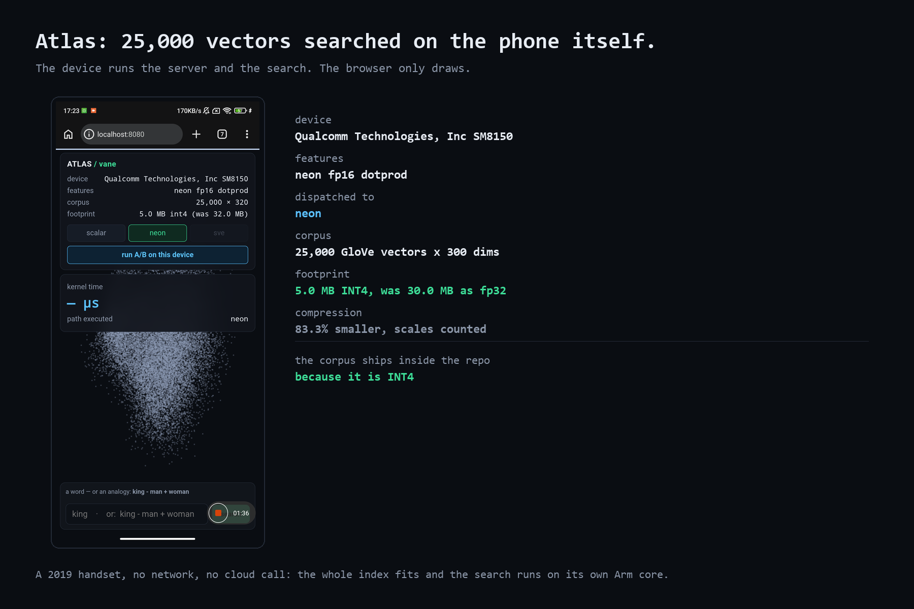

# demo/atlas — semantic search, computed on Arm

25,000 GloVe word vectors, quantised into Vane's INT4 format and searched with
a single `vn_dequant_gemv_int4` call per query. The browser only draws; every
similarity score and every microsecond figure it shows came out of a kernel
running on the Arm core serving the page.



## Run it

`demo/atlas.bin` is committed to this repository, so there is nothing to
download or build first.

**Linux, macOS, Graviton:**
```bash
cmake -B build && cmake --build build
./build/atlas_server --data demo/atlas.bin --html demo/atlas.html
# open http://localhost:8080
```

**Android or Meta Quest** (build, push, forward, all in one step):
```powershell
.\demo\run_on_android.ps1
# open http://localhost:8080 — on the headset, its own in-VR browser works too
```

The server takes `--data`, `--html` and `--port`; the default port is 8080.

## What to try

- Type a word: `king`, `arm`, `fast`, `ocean`.
- Toggle **scalar / neon / sve** mid-session — same query, same device,
  different kernel. The microsecond figure changes because the kernel did.
- `/api/analogy?a=king&b=man&c=woman` — the classic vector arithmetic,
  computed the same way as a plain search.

## The corpus

| | |
|---|---|
| Words | 25,000 |
| Dimensions | 300, zero-padded to 320 (a multiple of the 32-element INT4 block) |
| On disk | `atlas.bin`, 5.4 MB — 5.0 MB of packed INT4 plus scales, 2-D coordinates and the word list |
| Same vectors as fp32 | 30.0 MB |
| Compression | **83.3% smaller** |

The compression figure is measured against the *unpadded* 300-dimension source,
which is the honest comparison. Padding to 320 would inflate both sides and
flatter the ratio; [`atlas_pack.py`](atlas_pack.py) prints both and says which
one to prefer. Zeros contribute nothing to a dot product, so the padding cannot
change a ranking.

## Rebuild the corpus

Only needed if you want different words or a different GloVe dimensionality.

```bash
python -m pip install numpy
python demo/atlas_pack.py glove.6B.300d.txt demo/atlas.bin --words 25000
```

`glove.6B.300d.txt` comes from the [Stanford GloVe
project](https://nlp.stanford.edu/projects/glove/), inside `glove.6B.zip`. The
committed `atlas.bin` was built from exactly that file with exactly that
command.

## Measured

Captured verbatim by the deploy scripts; see
[`results/`](../results/README.md).

**AWS Graviton4** — [`graviton4-atlas.txt`](../results/graviton4-atlas.txt),
per-query search, median of 15:

| path | median | min |
|---|---:|---:|
| scalar | 3,011 µs | 3,006 µs |
| neon | **1,455 µs** | 1,444 µs |
| sve | 1,536 µs | 1,509 µs |

**Redmi K20 Pro** — [`k20-pro-atlas.txt`](../results/k20-pro-atlas.txt), scalar
and NEON interleaved request by request so both see the same core and the same
cache state, median of 15 pairs. The first four pairs:

```
scalar=   6,835 us  neon=   2,753 us  speedup=2.48x
scalar=   6,975 us  neon=   2,685 us  speedup=2.60x
scalar=   6,841 us  neon=   2,778 us  speedup=2.46x
scalar=   6,726 us  neon=   2,689 us  speedup=2.50x
```

Both captures also record the top-5 neighbours the corpus returned, so the
search is checkable rather than merely timed:

```
king       -> queen, prince, monarch, kingdom, throne
computer   -> computers, software, pc, computing, technology
ocean      -> sea, waters, seas, oceans, atlantic
```

## Why this is the honest version of a flashy demo

- **No SVE in JavaScript.** A browser cannot execute NEON or SVE; nothing here
  claims otherwise. The page fetches JSON from a native process and draws it.
- **The compression is physically present.** `atlas.bin` is 5.4 MB because it
  is INT4. The file size is the claim.
- **The kernel time and the benchmark's kernel time are the same
  measurement**, because `atlas_server` links the same `vane` library and
  calls the same dispatched function as `vane_bench`.
- **The A/B runs both paths on the machine in front of you**, in the same
  session, rather than comparing against a number recorded elsewhere.

See [../README.md](../README.md) for what Vane is and how it is verified.
